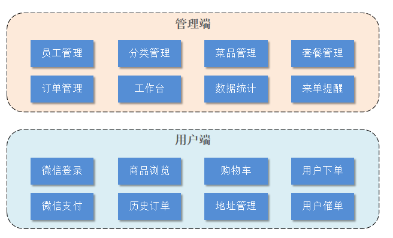
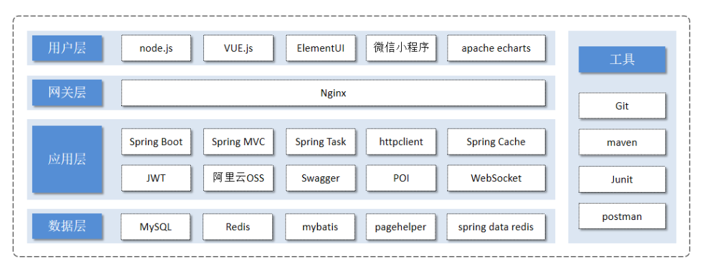

# Acknowledgments

Thanks to HeiMa Programmers (黑马程序员) for the original "Sky Take-Out" tutorial and guidance.

# Sky Takeout

## 1. Project Introduction

This project (Sky Takeout) is a software product specifically customized for catering enterprises (restaurants, eateries), including two parts: **System Management Backend** and **Mini Program Application**. The system management backend is mainly provided for internal staff of catering enterprises to manage and maintain restaurant categories, dishes, meal sets, orders, employees, etc., conduct statistics on various restaurant data, and also provide voice broadcast functionality for incoming orders. The mini program is mainly provided for consumers to browse dishes online, add to shopping cart, place orders, make payments, and request order updates.

## 2. Functional Architecture Diagram



### (1). Management Side Features

Employee login/logout, Employee information management, Category management, Dish management, Meal set management, Dish flavor management, Order management, Data statistics, Incoming order notifications.

### (2). User Side Features

WeChat login, Delivery address management, User order history query, Dish specification query, Shopping cart functionality, Order placement, Payment, Category and dish browsing.

## 3. Technology Selection



### (1). User Layer

In this project, when building the frontend pages of the system management backend, we use technologies such as H5, Vue.js, ElementUI, Apache ECharts (for displaying charts). When building mobile applications, we use WeChat Mini Programs.

### (2). Gateway Layer

Nginx is a server mainly used as an HTTP server for deploying static resources with high access performance. Nginx also has two important functions: reverse proxy and load balancing. When deploying projects, Nginx can be used to implement Tomcat load balancing.

### (3). Application Layer

**SpringBoot**: Rapid construction of Spring projects, adopting the "convention over configuration" philosophy to simplify Spring project configuration and development.
**SpringMVC**: SpringMVC is a module of the Spring framework that integrates seamlessly with Spring without requiring intermediate integration layers.
**Spring Task**: A scheduled task framework provided by Spring.
**HttpClient**: Mainly implements HTTP request sending.
**Spring Cache**: A data caching framework provided by Spring.
**JWT**: Tokens used for user authentication in applications.
**Alibaba Cloud OSS**: Object Storage Service, mainly used for storing files like images in the project.
**Swagger**: Automatically helps developers generate interface documentation and test interfaces.
**POI**: Encapsulates common operations for Excel spreadsheets.
**WebSocket**: A communication network protocol that makes data exchange between clients and servers simpler, used for implementing incoming order and order reminder functions in the project.

### (4). Data Layer

**MySQL**: Relational database, the core business data of this project will be stored using MySQL.
**Redis**: Memory database based on key-value format storage with fast access speed, often used for caching.
**MyBatis**: The persistence layer of this project will be developed using MyBatis.
**PageHelper**: Pagination plugin.
**Spring Data Redis**: Simplifies Java code for operating Redis APIs.

### (5). Tools

**Git**: Version control tool used for managing project code in team collaboration.
**Maven**: Project build tool.
**JUnit**: Unit testing tool, developers need to use JUnit for unit testing after implementing features.
**Postman**: Interface testing tool that simulates various HTTP requests initiated by users and obtains corresponding response results.

## 4. Technology Stack

- **Backend Framework**
  - SpringBoot
  - SpringMVC
  - Spring Task
  - HttpClient
  - Spring Cache
  - MyBatis
  - Swagger
  - WebSocket
  - Alibaba Cloud OSS
  - JWT
  - POI
  - WeChat Pay (simulated)
- **Database**
  - MySQL
  - Redis
- **Frontend Framework**
  - Vue
  - ElementUI
  - Vue-Router
  - Axios
  - ECharts
  - WeChat Mini Program

## 5. Configuration File Modifications

```yml
sky:
  datasource:
    driver-class-name: com.mysql.cj.jdbc.Driver
    host: localhost
    port: 3306
    database: sky_take_out
    username: your_local_username
    password: your_local_password
aliyun: # Alibaba Cloud configuration for file upload
  access-key-id: xxxxxxxxxxxxxxxxxxxx # Alibaba Cloud accessKey
  access-key-secret: xxxxxxxxxxxxxxxxxxxxxxxxxxxx # Alibaba Cloud secretKey
  endpoint: oss-cn-beijing.aliyuncs.com # Alibaba Cloud endpoint
  bucket-name: xxxxxxxx # Alibaba Cloud bucketName
redis:
  host: 192.168.100.128 # Redis address
  port: 6379 # Redis port
  password: xxxxxx # Redis password
  database: 0
wx: # WeChat configuration
  app-id: wxffb3637a228223b8 # WeChat public account appid
  app-secret: 84311df9199ecacdf4f12d27b6b9522d # WeChat public account appsecret
  mchid: 1561414331 # WeChat merchant ID
  mchSerialNo: 4B3B3DC35414AD50B1B755BAF8DE9CC7CF407606 # WeChat merchant key
  privateKeyFilePath: D:\pay\apiclient_key.pem # WeChat merchant private key file path
  apiV3Key: CZBK51236435wxpay435434323FFDuv3 # WeChat merchant v3 key
  weChatPayCertFilePath: D:\pay\wechatpay_166D96F876F45C7D07CE98952A96EC980368ACFC.pem # WeChat merchant certificate file path
  notifyUrl: http://xxxxxxxxx/notify/paySuccess # WeChat payment success callback URL (replace xxxx with domain from cpolar software)
  refundNotifyUrl: https://xxxxxxxxx/notify/refundSuccess # WeChat refund success callback URL (replace xxxx with domain from cpolar software)
shop:
  address: No. 11 Beiyuan East Road, Chaoyang District, Beijing
baidu:
  ak: xxxxxxxxxxxxxxxxxxx # Baidu Maps ak (need to apply for application on Baidu Maps Development Platform to get ak)
```

## 6. Project Demo

- **Admin Side**

**Dashboard:**


**Data Statistics:**


**Order Management:**


**Meal Set Management:**


**Dish Management:**


**Category Management:**


**Employee Management:**


- **User Side**

**Mini Program Homepage:**


**User Interface:**

